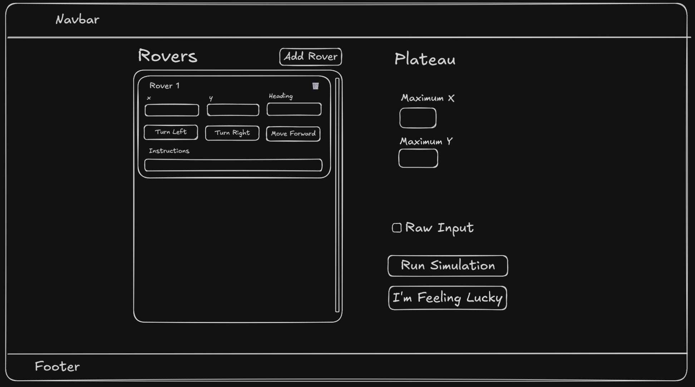
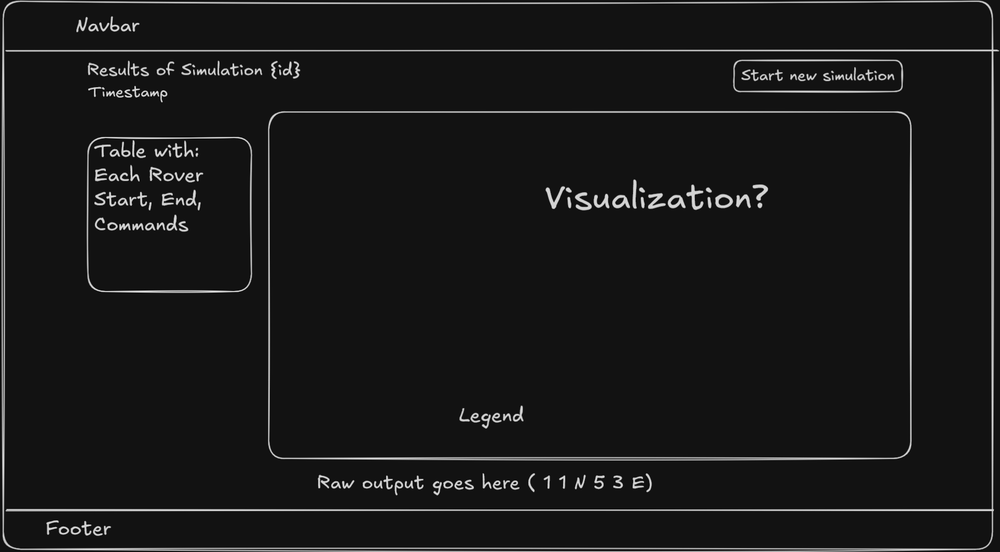

# IRISNDT Technical Evaluation - Rover Problem

See [the full assignment](docs/assignment.md) for more details on requirements.

## Running the Project

### Prerequisites

- .NET 10 SDK
  - Check `dotnet --version` == `10.0.x`

1. Clone Repo

```
git clone https://github.com/CorgiOnNeptune/rover-assignment-dotnet.git
cd rover-assignment-dotnet
```

2. Restore and build project

```
cd RoverSolution

dotnet restore
dotnet build

# run the Web and Api projects
dotnet run --project Rover.Api & dotnet run --project Rover.Web

# If having issues with SSL running localhost:
dotnet dev-certs https --trust
```

3. Run project

```
# run the Web and Api projects
dotnet run --project Rover.Api & dotnet run --project Rover.Web

# If having issues with SSL while running localhost:
dotnet dev-certs https --trust
```

OR
Alternatively can open the project solution with Visual Studio and launch the project via the "Web + API" launch profile.

4. Navigate to project
   1. You can find the frontend at https://localhost:7169
   2. API at https://localhost:7081
   3. Swagger endpoints explorer @ https://localhost:7081/swagger/index.html

5. Run unit tests (Pretty barebones tests)

```
cd RoverSolution
dotnet test
```

Screenshot note
The screenshot doesn't have a way to view on the frontend.
It does get saved in `RoverSolution/Rover.Api/Data/simulations.json` under the screenshot property.

You can view the image by decoding the base64 via a tool [like this](https://jaredwinick.github.io/base64-image-viewer/?ref=tiny-helpers).

## My Initial Thoughts and Plan

### The Rover Problem and Algorithm

#### The "algorithm"

The algorithm isn't very complicated for this problem. A simple loop through the provided commands and mapping each command via a service to handle the input and each instruction will invoke the appropriate `IRoverCommand` derived class and `Execute()` method to manipulate the rover's position. We'll push the history of the rover's movement to some sort of RoverHistory to track along the frontend visualization later and at the end we'll print out the rover's final position.

Main things to be aware of are accounting for the bounds of the current plateau as well as the rover's current position and direction to make sure it doesn't leave the bounds. If a `M` command would drive the rover out of the bounds of the plateau we'll simply ignore that command, but allow any turning commands regardless of the rover's position.

#### OOP

I'm approaching this with a sort of hybrid/simplified Command design pattern after initial thoughts. While this problem could be much larger or scalable with the possibility of introducing new types of rovers, new ways to move, and inter-cardinal directions, I'm trying not to over-engineer a lot with the scope of the assignment while showing off my knowledge and thought process. I think the `IRoverCommand` is a fine enough way that it could be extensible down the line and even the `MarsRover` class could be abstracted with small modifications to allow different rovers with different movement behaviours and allow the developer to encapsulate the pieces of that object that are varying to allow a larger scale program to be built.

### Tech and Requirements

1. A Web Service
   - ASP.NET Core Web API
     - RESTful design with controller-based architecture
       - POST `/api/simulations`
         - Create a simulation result.
         - Request body includes starting x, y and rovers with starting x,y,cardinal, and instructions.
         - Response: 200 | Array of finalPositions and/or a resultId to navigate to results page with visualization.
         - Either this or the next endpoint will handle saving to JSON.
       - POST `/api/simulations/{simulationId}/screenshot`
         - This will need to include image binary and base64 to "upload" the image to the web service and create the actual object in the `Data/simulations.json`
         - 201 Created
       - GET `/api/simulations`
       - GET `/api/simulations/{simulationId}`

     - History of all inputs/outputs stored into a JSON "db" file
       - (No point doing a full DB for this scale of a non-production project)
       - I landed on using a package I stumbled on [JsonFlatFileDataStore](https://www.nuget.org/packages/JsonFlatFileDataStore). Was very quick and easy to setup/understand. No setup or dependencies needed from users, just the restored package as part of the project solution.

2. An ASP.NET MVC or Core MVC app
   - ASP.NET Core MVC
     - 3 routes
       - root `/` or `/simulation`
         - Landing home page with simulations input.
       - `/simulation/history`
         - History of inputs and outputs.
       - `simulation/result/{resultId}`
         - Specific results from a run. (Taken to this page directly after submitting a run.)
     - Easy to use UI.
       - Simple input forms, easy for me and the user.
       - Either raw html/css or simple library like Bootstrap just for quick development.
     - Forms send all input to the API rather than handling input and calculations on the frontend.
     - Plateau visualization
       - Took web game approach of using a html table to create a grid of cells with borders.
     - "Screenshot"
       - Client-side handling. Used [html2canvas](https://github.com/niklasvh/html2canvas) and processed the div of the image.
       - Image is stored as base64 per simulation in `Rover.Api/Data/simulations.json`
       - Can be viewed via a decoder tool [like this](https://jaredwinick.github.io/base64-image-viewer/?ref=tiny-helpers).

### Frontend

This was my first time working with ASP.NET MVC (MVC specifically). So there was a decent learning curve, though many of the practices were still similar to other frameworks used before, just some different syntax.

I started by drawing some mockups with Excalidraw and then trying to build them out using mostly flexbox in the frontend with Bootstrap utility classes. I ended up shifting smaller pieces of the final design quite a bit. But generally lines up.




Getting the grid visual working was definitely a struggle at first, but I took inspiration from web games using grids. Particularly the dungeon system in an open-source project called [Pokeclicker](https://github.com/pokeclicker/pokeclicker). As well as more simple web-based games created with html tables such as tic tac toe.

#### Approach Order

1. Solve the actual problem and build out the "simulator" first.
   - Just the core algorithm, models, and functional results.
2. Build the API endpoints.
   - Adapt the simulator, make sure it can take in the appropriate expected input from a user.
3. Build the UI
   1. Create the forms for user input `/` || `/simulation`
      - Default form with "raw" input that just takes in the text input as detailed in the project specs.
        - Submit form sends to API and then page loads into `/results/{resultId}`
      - Stretch: Enhance form to also have options to use dropdown or per-detail inputs. (Inputs or dropdown for starting position, options to add rovers, etc.)
   2. Create `/results/{resultsId}` page to see results per submission
      - Start with just the raw output of the rover's final positions after receiving the inputs to move.
      - Includes plateau visualization.
        - Unsure yet of visual approach. Either SVG approach or creating a grid with HTML/CSS.
      - "Screenshot" of the plateau.
        - Unsure of library or tool to use in ASP.NET, require some research.
        - Save the screenshot to "server" directory and then save the path to `Data/simulations.json` for easy access in `/results` route on frontend.
   3. Create the `/results` page to see past operations.
      - Table showing inputs and outputs of each run, as well as an option to either view/download the screenshot. Also link to the `/results/{resultId}` resource page per result.

#### Project Structure

```
.
└── RoverSolution/
    ├── Rover.Api/
    │   ├── Controllers/
    │   └── Data/
    │       └── simulations.json
    ├── Rover.Core/
    │   ├── Commands
    │   ├── Enums
    │   ├── Models
    │   └── etc... (business logic)
    └── Rover.Web/
        ├── Controllers
        ├── Models
        └── Views
```

#### Request Flow

1. User submits simulation request through the UI
2. UI calls the API (POST `/api/simulation`)
3. Validate request
4. Some service from Rover.Core executes logic
5. A different service also saves initial results (separation of concerns here)
6. API returns response (Final positions and resultId at least)
7. UI renders the visualization
8. UI sends a screenshot back through the API (PUT or PATCH `/api/results/{resultId}`... This is PUT/PATCH so the result in history gets updated with the screenshot path.)
